# ⚠️ LEGACY DOCUMENTATION

**This document is superseded by**: [ARCHITECTURE_REFACTORED.md](ARCHITECTURE_REFACTORED.md)

**Last Updated**: 2025-11-02
**Status**: Historical reference only
**For current documentation, see**: [INDEX.md](INDEX.md)

---

# Architecture Documentation

This document provides comprehensive architecture diagrams and explanations for the Telemetry Injector system.

## Table of Contents

1. [System Overview](#system-overview)
2. [Core Components](#core-components)
3. [Execution Flow](#execution-flow)
4. [LLM Integration](#llm-integration)
5. [Parallel Processing](#parallel-processing)
6. [Token Detection](#token-detection)
7. [GPU Scheduling](#gpu-scheduling)
8. [Debug Trace Logging](#debug-trace-logging)

---

## System Overview

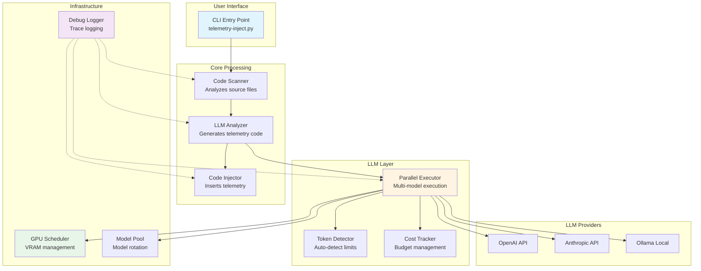

**Key Features:**
- Multi-provider LLM support (OpenAI, Anthropic, Ollama)
- Parallel execution with intelligent model rotation
- Automatic token limit detection
- VRAM-based GPU scheduling
- Comprehensive debug trace logging
- Cost tracking with budget limits

---

## Core Components

### 1. Code Scanner

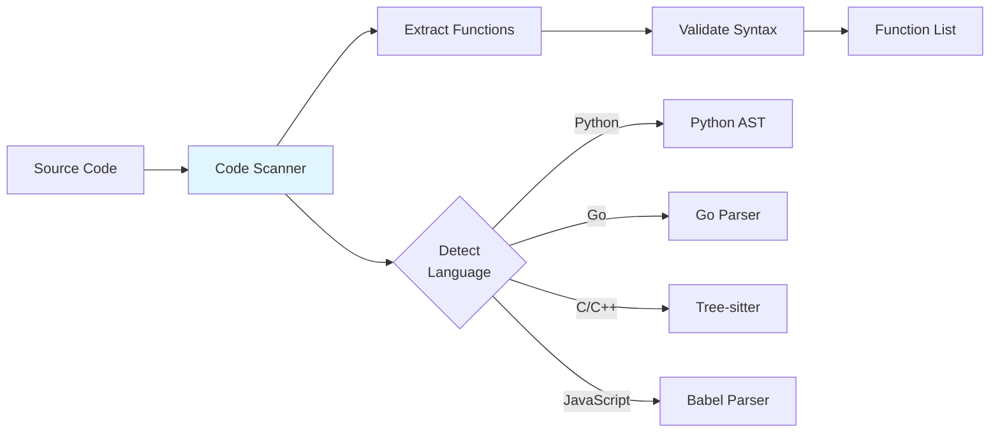

**Purpose:** Scans source code files and extracts functions for telemetry injection.

**Key Classes:**
- `CodeScanner`: Main scanner class
- `FunctionExtractor`: Language-specific function extraction

---

### 2. LLM Analyzer

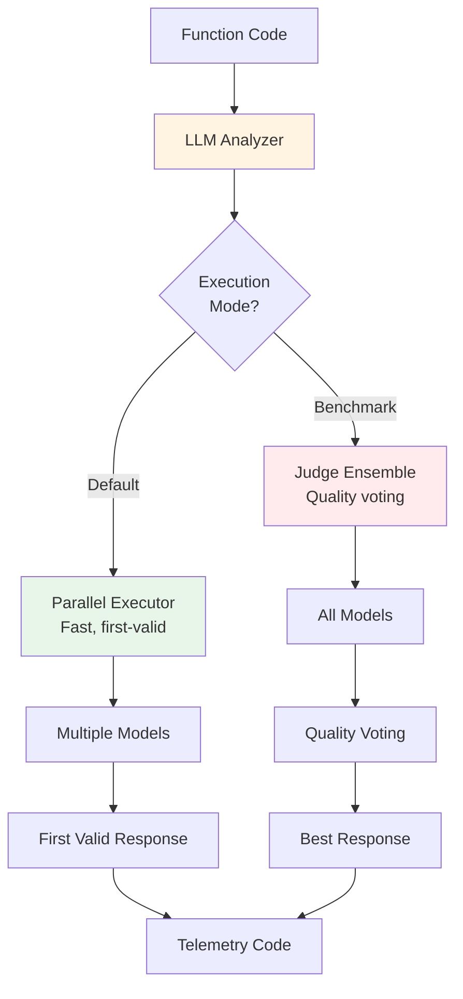

**Purpose:** Analyzes functions and generates telemetry code using LLMs.

**Execution Modes:**
1. **Default Mode** (Fast): Uses `ParallelExecutor` for first-valid response
2. **Benchmark Mode** (Quality): Uses `JudgeEnsemble` for voting-based quality

**Key Classes:**
- `LLMAnalyzer`: Main analyzer class
- `ParallelExecutor`: Parallel execution engine
- `JudgeEnsemble`: Quality voting system

---

### 3. Code Injector

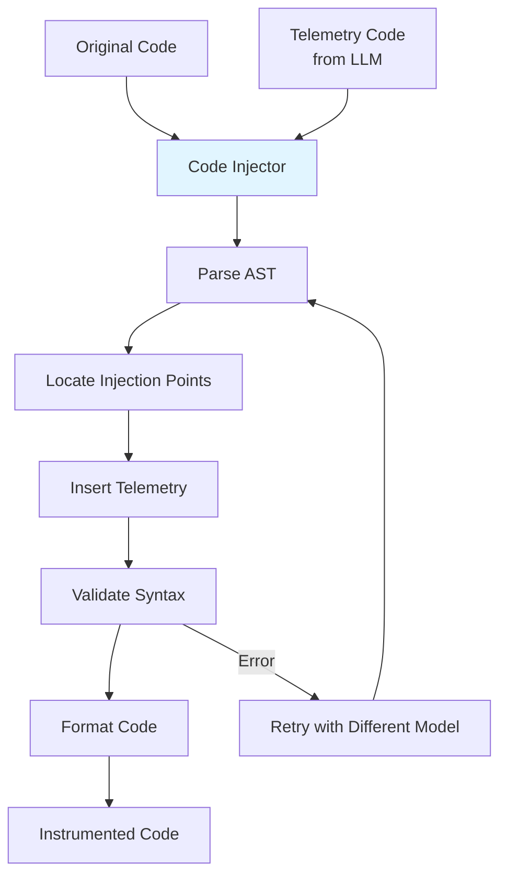

**Purpose:** Injects telemetry code into source files while maintaining syntax correctness.

**Key Classes:**
- `CodeInjector`: Main injection engine
- `FunctionInjector`: Function-level injection
- `CommandValidator`: Validates telemetry commands

---

## Execution Flow

### Default Execution Flow (Fast Mode)

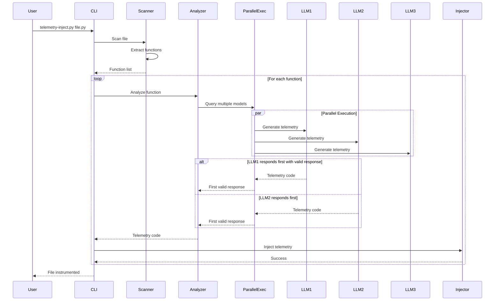

**Characteristics:**
- **Speed**: First valid response wins
- **Parallelism**: All models queried simultaneously
- **Cost**: Lower (stops after first success)
- **Use Case**: Production deployments

---

### Benchmark Execution Flow (Quality Mode)

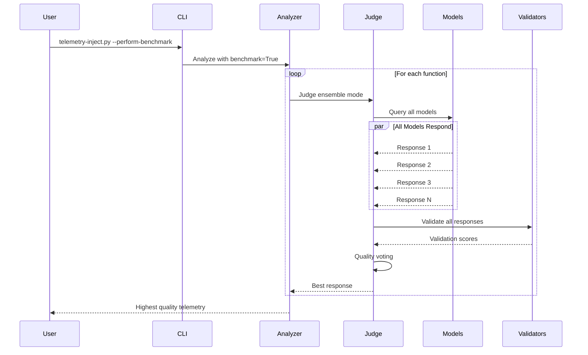

**Characteristics:**
- **Quality**: Best response via voting
- **Completeness**: All models must respond
- **Cost**: Higher (waits for all models)
- **Use Case**: Quality benchmarking and model testing

---

## LLM Integration

### Multi-Provider Support

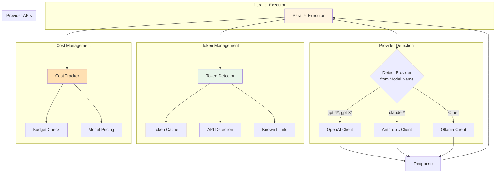

**Provider Detection Logic:**

```python
def _get_provider(model: str) -> str:
    """Auto-detect provider from model name."""
    model_lower = model.lower()

    # OpenAI models (precise matching)
    if (model_lower.startswith('gpt-3') or
        model_lower.startswith('gpt-4') or
        model_lower.startswith('o1-')):
        return 'openai'

    # Anthropic models
    elif 'claude' in model_lower:
        return 'anthropic'

    # Default to Ollama for local models
    else:
        return 'ollama'
```

---

## Parallel Processing

### Model Pool Rotation (Ollama)

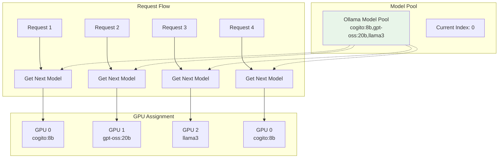

**Why Model Rotation?**

Ollama cannot run the same model on multiple GPUs simultaneously. Model rotation allows parallel processing by:

1. **Parsing comma-separated models**: `LLM_MODEL=cogito:8b,gpt-oss:20b,llama3`
2. **Round-robin assignment**: Each request gets the next model in the pool
3. **Parallel execution**: Different models run on different GPUs concurrently

**Implementation:**

```python
class OllamaModelPool:
    def __init__(self, model_spec: str):
        # Parse "model1,model2,model3"
        self.models = [m.strip() for m in model_spec.split(',')]
        self.current_index = 0
        self.lock = threading.Lock()

    def get_next_model(self) -> str:
        """Thread-safe round-robin rotation."""
        with self.lock:
            model = self.models[self.current_index]
            self.current_index = (self.current_index + 1) % len(self.models)
            return model
```

---

## Token Detection

### Auto-Detection Flow

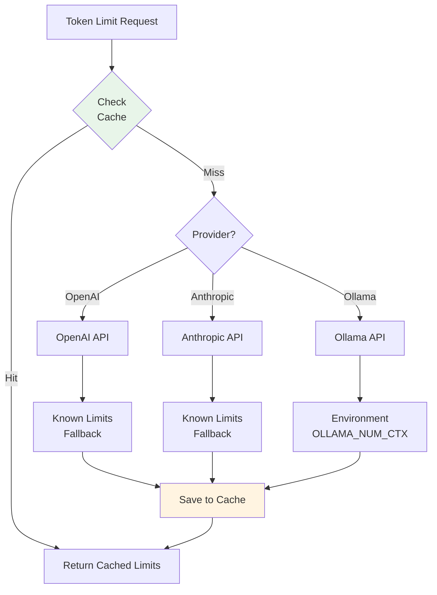

**Token Detection Process:**

1. **Check Cache**: Look for cached limits in `~/.cache/telemetry_injector/token_limits.json`
2. **API Detection**: Try to detect via provider API
3. **Known Limits**: Use pre-configured limits for common models
4. **Conservative Default**: Fall back to safe defaults (8192 input, 2048 output)

**Example Known Limits:**

```python
KNOWN_LIMITS = {
    # OpenAI
    "gpt-4o": (128000, 16384),
    "o1-mini": (128000, 65536),

    # Anthropic
    "claude-3-5-sonnet-20241022": (200000, 8192),

    # Ollama
    "codellama": (16384, 2048),
    "llama3": (8192, 2048),
}
```

---

## GPU Scheduling

### VRAM-Based Scheduling

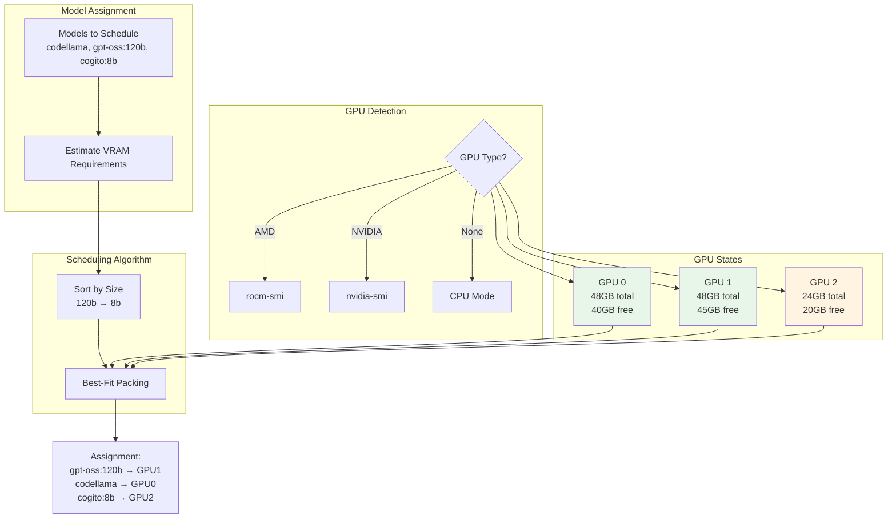

**VRAM Estimation:**

Models are estimated based on parameter count extracted from name:

```python
def estimate_vram(model_name: str) -> int:
    """
    Estimate VRAM requirements from model name.

    Rule: ~1.3 GB per billion parameters (FP16)
    Buffer: +20% for context and overhead

    Examples:
    - 7b model: ~10 GB
    - 20b model: ~30 GB
    - 120b model: ~180 GB
    """
    param_count = extract_param_count(model_name)  # e.g., "8b" → 8.0
    base_vram_gb = param_count * 1.3
    vram_with_buffer = base_vram_gb * 1.2
    return int(vram_with_buffer * 1024)  # Convert to MB
```

**Scheduling Algorithm:**

1. **Estimate**: Calculate VRAM requirements for all models
2. **Sort**: Largest models first (best-fit packing)
3. **Query GPUs**: Get current VRAM availability
4. **Assign**: Match models to GPUs with sufficient VRAM
5. **Fallback**: Use GPU with most free VRAM if none have enough

---

## Debug Trace Logging

### Logging Architecture

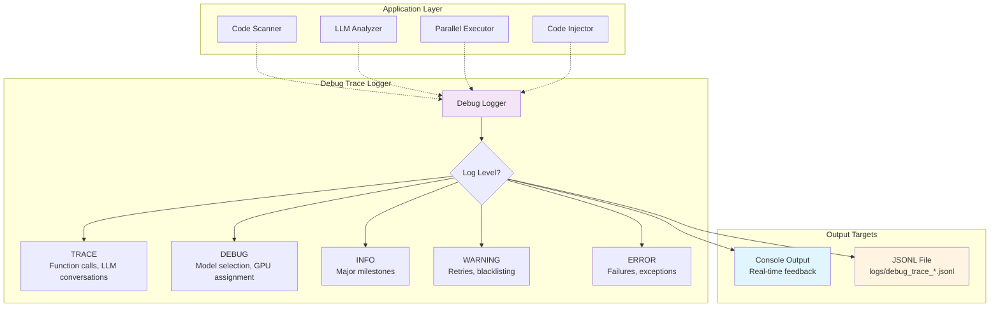

**Event Types Logged:**

```python
# Function calls
logger.function_call("analyze_code", code=code, language="python")

# LLM requests
logger.llm_request(
    model="gpt-4o",
    provider="openai",
    prompt=prompt,
    temperature=0.7
)

# LLM responses
logger.llm_response(
    model="gpt-4o",
    response=response,
    input_tokens=1500,
    output_tokens=800,
    duration=2.5,
    cost=0.045
)

# Model rotation
logger.model_rotation(
    model="cogito:8b",
    pool_size=3,
    index=0
)

# GPU assignment
logger.gpu_assignment(
    model="gpt-oss:120b",
    gpu_id=1,
    vram_free_mb=45000
)

# Token detection
logger.token_detection(
    model="claude-3-5-sonnet-20241022",
    provider="anthropic",
    max_input=200000,
    max_output=8192,
    from_cache=True
)
```

**Output Format (JSONL):**

```json
{"type": "event", "timestamp": 1234567890.123, "datetime": "2025-10-29T10:30:00.123", "level": "TRACE", "category": "llm_request", "message": "Sending request to gpt-4o", "data": {"model": "gpt-4o", "provider": "openai", "prompt": "...", "temperature": 0.7}}
{"type": "event", "timestamp": 1234567892.456, "datetime": "2025-10-29T10:30:02.456", "level": "TRACE", "category": "llm_response", "message": "Received response from gpt-4o", "data": {"model": "gpt-4o", "input_tokens": 1500, "output_tokens": 800, "cost_usd": "$0.045000"}}
```

**Usage:**

```bash
# Enable debug trace
export DEBUG_TRACE=true
export DEBUG_TRACE_LEVEL=TRACE  # TRACE, DEBUG, INFO, WARNING, ERROR
export DEBUG_TRACE_CONSOLE=true

# Run with debug trace
python telemetry-inject.py --input file.py

# View logs
cat logs/debug_trace_20251029_103000.jsonl | jq .
```

---

## Summary

The Telemetry Injector architecture is designed for:

1. **Performance**: Parallel execution with first-valid response
2. **Flexibility**: Multi-provider LLM support
3. **Intelligence**: Auto-detection of tokens and VRAM
4. **Scalability**: Model rotation for Ollama multi-GPU
5. **Observability**: Comprehensive debug trace logging
6. **Cost Control**: Budget management and cost tracking

For more details, see:
- [Examples](EXAMPLES.md) - Usage scenarios and examples
- [README](../README.md) - Quick start and configuration
