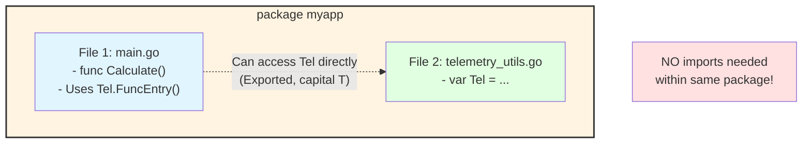

# Go Telemetry - Quick Reference

## What Was Fixed

❌ **Before:** `import "telemetry_utils"` → Compilation error: "package not in std"
✅ **After:** No import needed - Tel is available in same package

## How It Works

```go
package myapp  // Your package

// File 1: your code
func Calculate(x int) int {
    defer Tel.FuncExit(Tel.FuncEntry("Calculate", "x"))()  // No import!
    return x * 2
}

// File 2: _telemetry_utils.go (auto-generated, same package)
package myapp  // ← Same package name

var Tel = &TelemetryCollector{}  // ← Available to your code
```

**Key Insight:** Both files in same package → Tel is automatically available!

## Usage

```bash
# Instrument your Go code
python -m src.cli your/go/project -e .go -v

# Run with telemetry enabled
DEBUG=true go run instrumented/*.go
```

## Expected Code Output

### ✅ CORRECT (What You Should See)

```go
package main

func Add(a, b int) int {
    defer Tel.FuncExit(Tel.FuncEntry("Add", "a, b"))()
    result := a + b
    Tel.VarChange("result", result, "Add", 42)
    return result
}
```

**No import statements! Tel is used directly!**

### ❌ WRONG (If You See This, Report It)

```go
package main

import "telemetry_utils"  // ❌ This will fail!
import "_telemetry_utils"  // ❌ This will fail!

func Add(a, b int) int {
    tel.FuncEntry("Add", "a, b");  // ❌ Wrong capitalization + semicolon
    ...
}
```

## Training Examples in Prompts

The LLM now sees these examples:

**BAD Example (Causes Errors):**
```go
import "telemetry_utils"  // ❌ Causes: "package not in std" error
```

**GOOD Example (Works):**
```go
defer Tel.FuncEntry("MyFunc", "params")  // ✅ No import needed!
```

## Four Defense Layers

1. **Template:** Package name auto-detected (`package {{PACKAGE_NAME}}`)
2. **Writer:** Substitutes actual package name from your code
3. **Prompts:** BAD vs GOOD examples teach correct patterns
4. **System Messages:** "NEVER generate import statements" directive

## Quick Troubleshooting

### Problem: Still Getting Import Errors

```bash
# 1. Check generated code
cat instrumented/*.go | grep "import"
# Should see NO telemetry imports

# 2. Check package names match
head -1 instrumented/*.go
# All should have same "package xxx"

# 3. Verify utility file exists
ls instrumented/_telemetry_utils.go
# Should exist

# 4. Check package in utility
head -1 instrumented/_telemetry_utils.go
# Should match your package name
```

### Problem: Wrong Capitalization

If you see `tel.funcEntry` (lowercase):
- ✅ Should be: `Tel.FuncEntry` (uppercase)
- This means LLM didn't follow the examples
- Check LLM model and temperature

### Problem: Semicolons Appearing

If you see `Tel.FuncEntry(...);` (with semicolon):
- ✅ Should be: `Tel.FuncEntry(...)` (no semicolon)
- Go doesn't need semicolons
- LLM should be warned in prompts

## File Structure After Instrumentation

```
instrumented/
├── _telemetry_utils.go      # Auto-generated utility (same package)
├── main.go                   # Your code with telemetry
├── calculator.go             # Your code with telemetry
└── utils.go                  # Your code with telemetry

All files have: package main  # Or whatever your package is
```

## Compilation Test

```bash
cd instrumented
go build -v *.go

# Should see:
# - No "package not in std" errors
# - Successful compilation
# - Binary created
```

## Runtime Test

```bash
# Enable telemetry
DEBUG=true go run instrumented/*.go

# Should see JSON output to stderr:
# {"event_type":"function_entry","function_name":"Calculate",...}
# {"event_type":"function_exit","duration_ns":52250,...}
```

## Key Rules for LLM

The LLM is now trained with these explicit rules:

1. **NEVER ADD IMPORT STATEMENTS FOR TELEMETRY**
2. Use `Tel` (capital T), not `tel`
3. Method names are capitalized: `FuncEntry`, not `funcEntry`
4. NO semicolons at end of lines
5. Use `defer Tel.FuncExit(Tel.FuncEntry(...))()`
6. Tel is available directly - same package

## Why This Works



**Key Point:** Both files are in the **same package**, so Tel is automatically available without any import statements.

## Success Indicators

✅ No import statements in generated code
✅ Package names match across all files
✅ Tel is capitalized
✅ No semicolons
✅ Code compiles successfully
✅ Telemetry works with DEBUG=true

## Summary

**Problem:** Import statements caused "package not in std" error

**Solution:** Make _telemetry_utils.go part of SAME package
- No imports needed
- Tel is automatically available
- LLM trained with BAD vs GOOD examples
- System messages enforce "no imports" rule

**Result:** Clean, idiomatic Go code that compiles successfully!
