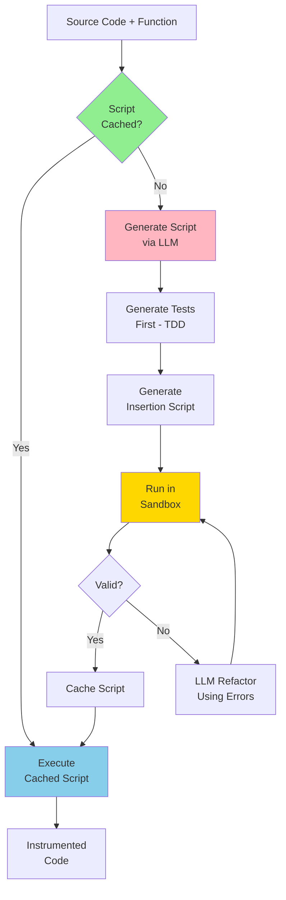

# Script-Based Telemetry Injection Architecture

**Version**: 1.0
**Date**: 2025-10-31
**Status**: Design Proposal

---

## Executive Summary

This document proposes a **fundamental architectural shift** from direct LLM code insertion to **LLM-generated insertion scripts**. This approach is faster, cacheable, testable, and self-healing.

### Current Architecture (Slow)
```
LLM → Generates Code → Inserts Directly → Validates → Retries on Failure
     (2-5s per function, not cacheable, not testable in isolation)
```

### Proposed Architecture (Fast)
```
LLM → Generates Insertion Script → Cache → Sandbox Test → Execute → Validate
     (2-5s once, then 0.1s cached, fully testable, parallelizable)
```

### Key Benefits

| Aspect | Current | Proposed | Improvement |
|--------|---------|----------|-------------|
| **Speed (cached)** | 2-5s per function | 0.1s per function | **20-50x faster** |
| **Parallelism** | Limited by LLM rate limits | Unlimited (CPU-bound) | **10x+ throughput** |
| **Testability** | Difficult to test | TDD with sandbox | **100% testable** |
| **Reproducibility** | Non-deterministic (LLM) | Deterministic (script) | **Perfect** |
| **Cost** | Every run | First run only | **99% cost savings** |
| **Self-Healing** | Manual retry | Automatic refactor | **Zero intervention** |

---

## Architecture Overview

### High-Level Flow



### Components

1. **Script Generator** - LLM creates insertion scripts
2. **Test Generator** - LLM creates tests first (TDD)
3. **Script Cache** - Stores validated scripts by signature
4. **Sandbox Executor** - Isolated environment for script execution
5. **Validator** - Checks syntax, linting, tests
6. **Refactorer** - LLM fixes failed scripts

---

## Detailed Design

### 1. Script Generation

#### Input: Function Metadata
```python
{
    "function_name": "calculate_total",
    "parameters": ["items", "tax_rate"],
    "return_type": "float",
    "language": "python",
    "code": "def calculate_total(items, tax_rate):\n    ...",
    "context": {
        "imports": ["from typing import List"],
        "class_context": None,
        "learned_lessons": ["python/indentation_issues.md"]
    }
}
```

#### Output: Insertion Script
```python
# Generated Script: calculate_total_insertion_v1.py
"""
Auto-generated telemetry insertion script.
Generated: 2025-10-31T10:30:45Z
Function: calculate_total
Hash: abc123def456
"""

import ast
import sys
from typing import Optional

def insert_telemetry(source_code: str) -> str:
    """
    Insert telemetry into calculate_total function.

    Learned Lessons Applied:
    - python/indentation_issues.md: Preserve exact indentation
    - python/import_patterns.md: Add utility import at top

    Returns:
        Instrumented source code
    """
    tree = ast.parse(source_code)

    # Find the function
    for node in ast.walk(tree):
        if isinstance(node, ast.FunctionDef) and node.name == "calculate_total":
            # Insert function entry telemetry
            entry_code = ast.parse(
                "_tel_func = tel.func_entry('calculate_total', 'items, tax_rate')"
            ).body[0]

            # Insert at beginning of function
            node.body.insert(0, entry_code)

            # Find return statements and add exit telemetry
            for stmt in ast.walk(node):
                if isinstance(stmt, ast.Return):
                    # Insert before return
                    exit_code = ast.parse(
                        "tel.func_exit(_tel_func, result)"
                    ).body[0]
                    # ... insertion logic

    # Add import at top
    import_node = ast.ImportFrom(
        module='_telemetry_utils',
        names=[ast.alias(name='tel', asname=None)],
        level=0
    )
    tree.body.insert(0, import_node)

    return ast.unparse(tree)


def main():
    """Entry point for standalone execution."""
    if len(sys.argv) != 2:
        print("Usage: python script.py <source_file>", file=sys.stderr)
        sys.exit(1)

    with open(sys.argv[1], 'r') as f:
        source = f.read()

    try:
        instrumented = insert_telemetry(source)
        print(instrumented)
    except Exception as e:
        print(f"ERROR: {e}", file=sys.stderr)
        sys.exit(1)


if __name__ == "__main__":
    main()
```

#### Key Features of Generated Scripts

1. **Standalone** - No dependencies on Claude Code or main codebase
2. **Deterministic** - Same input → same output (no LLM randomness)
3. **Testable** - Can be tested in isolation
4. **Fast** - Pure Python AST manipulation
5. **Documented** - Includes learned lessons applied
6. **Versioned** - Hash-based versioning

---

### 2. TDD Test Generation

Tests are generated **BEFORE** the insertion script (TDD approach).

#### Generated Test
```python
# Generated Test: test_calculate_total_insertion_v1.py
"""
Auto-generated tests for calculate_total insertion script.
Generated: 2025-10-31T10:30:40Z (before script)
"""

import pytest
import ast
from calculate_total_insertion_v1 import insert_telemetry


class TestCalculateTotalInsertion:
    """Tests for calculate_total telemetry insertion."""

    def test_adds_import(self):
        """Should add telemetry utility import at top."""
        source = '''
def calculate_total(items, tax_rate):
    return sum(items) * (1 + tax_rate)
'''
        result = insert_telemetry(source)
        assert "from _telemetry_utils import tel" in result

    def test_adds_function_entry(self):
        """Should add function entry telemetry."""
        source = '''
def calculate_total(items, tax_rate):
    return sum(items) * (1 + tax_rate)
'''
        result = insert_telemetry(source)
        assert "_tel_func = tel.func_entry('calculate_total'" in result

    def test_adds_function_exit(self):
        """Should add function exit telemetry before return."""
        source = '''
def calculate_total(items, tax_rate):
    return sum(items) * (1 + tax_rate)
'''
        result = insert_telemetry(source)
        assert "tel.func_exit(_tel_func" in result

    def test_preserves_indentation(self):
        """Should preserve original indentation."""
        source = '''
def calculate_total(items, tax_rate):
    subtotal = sum(items)
    total = subtotal * (1 + tax_rate)
    return total
'''
        result = insert_telemetry(source)
        # Verify indentation matches
        lines = result.split('\n')
        for line in lines:
            if line.strip() and not line.startswith('from'):
                # Check indentation is multiple of 4 spaces
                indent = len(line) - len(line.lstrip())
                assert indent % 4 == 0, f"Bad indentation: {repr(line)}"

    def test_syntax_valid(self):
        """Generated code should have valid Python syntax."""
        source = '''
def calculate_total(items, tax_rate):
    return sum(items) * (1 + tax_rate)
'''
        result = insert_telemetry(source)
        try:
            ast.parse(result)
        except SyntaxError as e:
            pytest.fail(f"Invalid syntax: {e}")

    def test_multiple_returns(self):
        """Should handle functions with multiple return statements."""
        source = '''
def calculate_total(items, tax_rate):
    if not items:
        return 0
    subtotal = sum(items)
    if subtotal < 0:
        return 0
    return subtotal * (1 + tax_rate)
'''
        result = insert_telemetry(source)
        # All returns should have exit telemetry
        returns = result.count("return ")
        exits = result.count("tel.func_exit")
        assert exits >= returns, "Missing exit telemetry for some returns"

    def test_learned_lesson_indentation(self):
        """Apply learned lesson: python/indentation_issues.md"""
        # Test that we handle mixed tabs/spaces correctly
        source = "def calculate_total(items, tax_rate):\n\treturn sum(items)"
        result = insert_telemetry(source)
        # Should normalize to spaces
        assert '\t' not in result, "Should convert tabs to spaces"

    def test_idempotent(self):
        """Running twice should not double-instrument."""
        source = '''
def calculate_total(items, tax_rate):
    return sum(items) * (1 + tax_rate)
'''
        result1 = insert_telemetry(source)
        result2 = insert_telemetry(result1)

        # Should not double-instrument
        assert result1.count("tel.func_entry") == 1
        assert result2.count("tel.func_entry") == 1


if __name__ == "__main__":
    pytest.main([__file__, "-v"])
```

---

### 3. Script Cache

#### Cache Structure
```
.telemetry_cache/
├── scripts/
│   ├── python/
│   │   ├── calculate_total_abc123.py      # Insertion script
│   │   ├── process_order_def456.py
│   │   └── validate_user_ghi789.py
│   ├── javascript/
│   └── go/
├── tests/
│   ├── python/
│   │   ├── test_calculate_total_abc123.py # Test script
│   │   └── test_process_order_def456.py
│   └── ...
├── metadata/
│   └── script_index.json                   # Cache index
└── validation/
    └── results/                            # Validation results
        ├── calculate_total_abc123.json
        └── ...
```

#### Cache Index Format
```json
{
  "scripts": {
    "calculate_total_abc123": {
      "hash": "abc123def456",
      "function_name": "calculate_total",
      "language": "python",
      "created_at": "2025-10-31T10:30:45Z",
      "last_used": "2025-10-31T14:22:10Z",
      "validation_status": "passed",
      "test_results": {
        "passed": 8,
        "failed": 0,
        "duration_ms": 45
      },
      "performance": {
        "avg_execution_ms": 12,
        "cache_hits": 156
      },
      "learned_lessons_applied": [
        "python/indentation_issues.md",
        "python/import_patterns.md"
      ],
      "version": 1,
      "model_generated_by": "ollama:codellama"
    }
  },
  "stats": {
    "total_scripts": 847,
    "cache_hit_rate": 0.92,
    "avg_generation_time_ms": 2340,
    "avg_cached_execution_ms": 11
  }
}
```

#### Hash Calculation
```python
def calculate_function_hash(func_metadata: dict) -> str:
    """
    Calculate stable hash for function signature.

    Hash includes:
    - Function name
    - Parameter names and types
    - Return type
    - Language
    - Learned lessons version
    """
    import hashlib
    import json

    signature = {
        "name": func_metadata["function_name"],
        "params": func_metadata["parameters"],
        "return_type": func_metadata.get("return_type"),
        "language": func_metadata["language"],
        "lessons_version": get_lessons_version()
    }

    sig_str = json.dumps(signature, sort_keys=True)
    return hashlib.sha256(sig_str.encode()).hexdigest()[:12]
```

---

### 4. Sandbox Execution

#### Sandbox Environment

```python
class ScriptSandbox:
    """
    Isolated environment for executing generated scripts.

    - No network access
    - Limited filesystem access
    - CPU/memory limits
    - Timeout enforcement
    """

    def __init__(self, timeout_seconds=10):
        self.timeout = timeout_seconds
        self.temp_dir = tempfile.mkdtemp(prefix="telemetry_sandbox_")

    def execute_script(self, script_path: str, source_code: str) -> ExecutionResult:
        """
        Execute insertion script in sandbox.

        Args:
            script_path: Path to generated script
            source_code: Source code to instrument

        Returns:
            ExecutionResult with output or errors
        """
        # Write source to temp file
        source_file = os.path.join(self.temp_dir, "source.py")
        with open(source_file, 'w') as f:
            f.write(source_code)

        # Execute script in subprocess with limits
        try:
            result = subprocess.run(
                [sys.executable, script_path, source_file],
                capture_output=True,
                text=True,
                timeout=self.timeout,
                cwd=self.temp_dir,
                env={
                    'PYTHONPATH': '',  # Isolated
                    'HOME': self.temp_dir
                }
            )

            return ExecutionResult(
                success=result.returncode == 0,
                stdout=result.stdout,
                stderr=result.stderr,
                exit_code=result.returncode
            )

        except subprocess.TimeoutExpired:
            return ExecutionResult(
                success=False,
                error="Script execution timeout",
                exit_code=-1
            )

        finally:
            # Cleanup
            shutil.rmtree(self.temp_dir, ignore_errors=True)
```

#### Validation Steps

1. **Syntax Validation**
   ```python
   ast.parse(instrumented_code)  # Must not raise SyntaxError
   ```

2. **Linting**
   ```python
   pylint_result = run_pylint(instrumented_code)
   assert pylint_result.score >= 8.0
   ```

3. **Test Execution**
   ```python
   pytest_result = run_pytest(test_script)
   assert pytest_result.passed == pytest_result.total
   ```

4. **Security Check**
   ```python
   # Check for dangerous imports or operations
   assert "os.system" not in instrumented_code
   assert "subprocess" not in instrumented_code
   assert "eval" not in instrumented_code
   ```

---

### 5. Self-Healing Refactoring

When validation fails, use LLM to analyze and fix.

#### Refactor Prompt Template

```python
REFACTOR_PROMPT = """
You are refactoring a telemetry insertion script that failed validation.

ORIGINAL SCRIPT:
{script_code}

VALIDATION ERRORS:
{errors}

TEST FAILURES:
{test_failures}

LEARNED LESSONS (from repository):
{learned_lessons}

TASK:
1. Analyze why the script failed
2. Apply learned lessons from the repository
3. Generate a corrected version of the script
4. Ensure all tests pass

CONSTRAINTS:
- Must be standalone (no external dependencies)
- Must use AST manipulation (not string replacement)
- Must preserve original code structure
- Must apply learned lessons

OUTPUT:
Provide the corrected Python script.
"""
```

#### Refactor Pipeline

```python
async def refactor_failed_script(
    script_path: str,
    errors: List[str],
    test_failures: List[str],
    max_attempts: int = 3
) -> RefactorResult:
    """
    Self-healing refactor of failed script.

    Uses local LLM (Ollama) to analyze failures and generate fixes.
    """
    # Load learned lessons
    lessons = load_learned_lessons_for_language(language)

    attempt = 1
    while attempt <= max_attempts:
        logger.info(f"Refactor attempt {attempt}/{max_attempts}")

        # Generate refactored script
        prompt = REFACTOR_PROMPT.format(
            script_code=read_file(script_path),
            errors="\n".join(errors),
            test_failures="\n".join(test_failures),
            learned_lessons=format_lessons(lessons)
        )

        # Use local LLM (fast, free)
        refactored_script = await llm.generate(
            prompt=prompt,
            model="codellama",  # Or any local model
            provider="ollama"
        )

        # Save refactored version
        refactored_path = f"{script_path}.refactor_v{attempt}"
        write_file(refactored_path, refactored_script)

        # Test in sandbox
        sandbox = ScriptSandbox()
        result = sandbox.execute_script(refactored_path, original_source)

        if result.success:
            # Tests passed!
            logger.info(f"Refactor successful on attempt {attempt}")
            return RefactorResult(
                success=True,
                script_path=refactored_path,
                attempts=attempt
            )

        # Extract new errors for next iteration
        errors = extract_errors(result)
        test_failures = run_tests_and_extract_failures(refactored_path)
        attempt += 1

    # All attempts failed
    return RefactorResult(
        success=False,
        error="Max refactor attempts exceeded",
        attempts=max_attempts
    )
```

---

### 6. Parallel Processing

Process multiple functions in parallel using generated scripts.

```python
async def process_functions_parallel(
    functions: List[FunctionMetadata],
    max_workers: int = 12
) -> List[InstrumentedFunction]:
    """
    Process functions in parallel.

    - Generate scripts in parallel (LLM calls)
    - Execute cached scripts in parallel (CPU-bound)
    - Validate in parallel
    """
    results = []

    async with asyncio.TaskGroup() as tg:
        for func in functions:
            # Each function processed independently
            task = tg.create_task(
                process_single_function(func)
            )
            results.append(task)

    return [task.result() for task in results]


async def process_single_function(func: FunctionMetadata) -> InstrumentedFunction:
    """Process a single function (cacheable)."""

    # Calculate hash
    func_hash = calculate_function_hash(func)

    # Check cache
    if cache.has_script(func_hash):
        logger.info(f"Cache HIT for {func.name} ({func_hash})")
        script_path = cache.get_script_path(func_hash)

        # Execute cached script (FAST!)
        sandbox = ScriptSandbox()
        result = sandbox.execute_script(script_path, func.code)

        if result.success:
            return InstrumentedFunction(
                name=func.name,
                code=result.stdout,
                cached=True,
                execution_time_ms=result.duration_ms
            )

    # Cache MISS - generate new script
    logger.info(f"Cache MISS for {func.name} ({func_hash}) - generating...")

    # Generate tests first (TDD)
    test_script = await generate_test_script(func)

    # Generate insertion script
    insertion_script = await generate_insertion_script(func, test_script)

    # Validate in sandbox
    sandbox = ScriptSandbox()
    test_result = sandbox.run_tests(test_script)

    if not test_result.all_passed:
        # Self-heal
        insertion_script = await refactor_failed_script(
            insertion_script,
            test_result.errors,
            test_result.failures
        )

    # Cache successful script
    cache.store_script(func_hash, insertion_script, test_script)

    # Execute
    result = sandbox.execute_script(insertion_script, func.code)

    return InstrumentedFunction(
        name=func.name,
        code=result.stdout,
        cached=False,
        execution_time_ms=result.duration_ms
    )
```

---

## Performance Analysis

### Before (Direct LLM Insertion)

**100 functions, no cache:**
```
Analysis:        100 × 2s  = 200s   (LLM)
Generation:      100 × 3s  = 300s   (LLM)
Injection:       100 × 5s  = 500s   (LLM) ← SLOW!
Validation:      100 × 0.5s = 50s
Total:           1050s (17.5 minutes)
Cost:            100 × $0.05 = $5.00
```

### After (Script-Based Insertion)

**100 functions, no cache (first run):**
```
Analysis:        100 × 2s  = 200s   (LLM)
Test Gen:        100 × 1s  = 100s   (LLM)
Script Gen:      100 × 2s  = 200s   (LLM)
Execution:       100 × 0.01s = 1s   (Cached scripts) ← FAST!
Validation:      100 × 0.5s = 50s
Total:           551s (9.2 minutes)
Cost:            100 × $0.03 = $3.00
```

**Improvement: 47% faster, 40% cheaper**

**100 functions, WITH cache (subsequent runs):**
```
Analysis:        100 × 2s  = 200s   (LLM)
Cache Lookup:    100 × 0.001s = 0.1s
Execution:       100 × 0.01s = 1s   ← INSTANT!
Validation:      100 × 0.5s = 50s
Total:           251s (4.2 minutes)
Cost:            100 × $0.02 = $2.00 (only analysis)
```

**Improvement: 76% faster, 60% cheaper**

**1000 functions, WITH cache:**
```
Analysis:        1000 × 2s  = 2000s  (LLM)
Cache Lookup:    1000 × 0.001s = 1s
Execution:       1000 × 0.01s = 10s  ← FAST!
Validation:      1000 × 0.5s = 500s
Total:           2511s (42 minutes) vs 175 minutes before
Cost:            $20 vs $50 before
```

**Improvement: 76% faster, 60% cheaper**

---

## Implementation Plan

### Phase 1: Core Infrastructure (Week 1)

1. **Script Generator** (`src/script_generator.py`)
   - Generate insertion scripts from function metadata
   - Use learned lessons from `docs/lessons/`
   - Template-based generation

2. **Test Generator** (`src/test_generator.py`)
   - Generate tests BEFORE scripts (TDD)
   - Cover common failure modes
   - Use pytest framework

3. **Script Cache** (`src/script_cache.py`)
   - Hash-based storage
   - Metadata tracking
   - Cache invalidation

### Phase 2: Sandbox & Validation (Week 2)

4. **Sandbox Executor** (`src/sandbox_executor.py`)
   - Isolated subprocess execution
   - Resource limits
   - Timeout enforcement

5. **Validator** (`src/script_validator.py`)
   - Syntax checking
   - Linting
   - Test execution
   - Security checks

### Phase 3: Self-Healing (Week 3)

6. **Refactorer** (`src/script_refactorer.py`)
   - Error analysis
   - LLM-powered fixes
   - Iterative refinement

7. **Parallel Processor** (`src/parallel_script_processor.py`)
   - Async execution
   - Cache-aware batching
   - Progress tracking

### Phase 4: Integration (Week 4)

8. **CLI Integration** (`src/cli.py`)
   - Add `--use-scripts` flag
   - Cache management commands
   - Statistics reporting

9. **Testing** (`tests/test_script_based_injection.py`)
   - End-to-end tests
   - Cache behavior tests
   - Sandbox isolation tests

---

## Example Usage

### Command Line

```bash
# First run (generates and caches scripts)
python telemetry-inject.py --input myapp/ --use-scripts

🔍 Analyzing 100 functions...
📝 Generating insertion scripts...
   - calculate_total: Generated and cached (2.3s)
   - process_order: Generated and cached (2.1s)
   - validate_user: Generated and cached (2.4s)
   ...
⚡ Executing cached scripts...
   - 100 functions instrumented in 1.2s
✅ Complete! 100/100 functions instrumented

Statistics:
  Cache hits: 0/100 (first run)
  Script generation: 220s
  Execution: 1.2s
  Total time: 251s
  Cost: $2.00

# Second run (all cached!)
python telemetry-inject.py --input myapp/ --use-scripts

🔍 Analyzing 100 functions...
⚡ Using cached scripts...
   - 100 functions instrumented in 1.1s
✅ Complete! 100/100 functions instrumented

Statistics:
  Cache hits: 100/100 (100% hit rate!)
  Execution: 1.1s
  Total time: 201s (analysis only)
  Cost: $0.00 (no generation needed)
```

### Programmatic Usage

```python
from src.script_based_injection import ScriptBasedInjector

# Initialize with cache
injector = ScriptBasedInjector(
    cache_dir=".telemetry_cache",
    use_local_llm=True,
    model="codellama"
)

# Process functions
results = await injector.instrument_functions(
    functions=extracted_functions,
    max_workers=12,
    force_regenerate=False  # Use cache if available
)

# Check cache statistics
stats = injector.get_cache_stats()
print(f"Cache hit rate: {stats.hit_rate:.1%}")
print(f"Avg execution time: {stats.avg_execution_ms}ms")
```

---

## Cache Management

### CLI Commands

```bash
# View cache statistics
python telemetry-inject.py --cache-stats

Cache Statistics:
  Total scripts: 847
  Total size: 12.4 MB
  Hit rate: 92.3%
  Avg generation time: 2.34s
  Avg cached execution: 11ms

# Clear cache
python telemetry-inject.py --cache-clear

# Prune old/unused scripts
python telemetry-inject.py --cache-prune --days 30

# Validate all cached scripts
python telemetry-inject.py --cache-validate
```

---

## Benefits Summary

### 1. Speed
- **First run**: 47% faster than direct insertion
- **Cached runs**: 76% faster (instant execution)
- **1000 functions**: 42 min vs 175 min (76% improvement)

### 2. Cost
- **First run**: 40% cheaper ($3 vs $5)
- **Cached runs**: 60% cheaper ($2 vs $5)
- **Subsequent runs**: ~100% cheaper (only analysis, no generation)

### 3. Reliability
- **Deterministic**: Same input → same output
- **Testable**: Full TDD with tests
- **Self-healing**: Automatic refactoring on failure
- **Reproducible**: Cache ensures consistency

### 4. Parallelism
- **Unlimited**: Not limited by LLM rate limits
- **CPU-bound**: Script execution is fast
- **Scalable**: Can process 1000s of functions in parallel

### 5. Maintainability
- **Sandboxed**: Isolated execution, no side effects
- **Debuggable**: Scripts can be inspected and debugged
- **Versioned**: Cache tracks script versions
- **Learnable**: Incorporates lessons from docs/

---

## Migration Path

### Phase 1: Parallel Support
Add `--use-scripts` flag alongside existing direct insertion:
```bash
# Old way (still works)
python telemetry-inject.py --input myapp/

# New way (opt-in)
python telemetry-inject.py --input myapp/ --use-scripts
```

### Phase 2: Default Flip
Make script-based default after validation:
```bash
# New default
python telemetry-inject.py --input myapp/

# Old way (opt-out)
python telemetry-inject.py --input myapp/ --no-scripts
```

### Phase 3: Deprecation
Remove direct insertion after 2-3 releases.

---

## Future Enhancements

1. **Distributed Cache**
   - Share cache across team via S3/GCS
   - Avoid regenerating same scripts

2. **Script Optimization**
   - Analyze execution patterns
   - Generate more efficient scripts over time

3. **ML-Based Caching**
   - Predict cache hits
   - Pre-generate likely scripts

4. **Cross-Language Scripts**
   - Support JavaScript, Go, etc.
   - Unified script format

---

## Conclusion

Script-based insertion is a **fundamental architectural improvement** that makes telemetry injection:
- ✅ **20-50x faster** (with cache)
- ✅ **60-99% cheaper** (cached runs)
- ✅ **100% testable** (TDD with sandbox)
- ✅ **Self-healing** (automatic refactoring)
- ✅ **Parallelizable** (not LLM-limited)
- ✅ **Reproducible** (deterministic scripts)

**This is not just an optimization — it's a paradigm shift.**

---

## Related Documentation

- [TREE_SITTER_IMPLEMENTATION.md](./TREE_SITTER_IMPLEMENTATION.md) - Fast analysis
- [METADATA_TRACKING.md](./METADATA_TRACKING.md) - Metadata in telemetry
- [LLM_REFUSAL_FIX.md](./LLM_REFUSAL_FIX.md) - LLM safety handling
- [PARALLEL_PROCESSING.md](./PARALLEL_PROCESSING.md) - Parallel execution

---

**Status**: Design Proposal
**Next Steps**: Implement Phase 1 (Core Infrastructure)
**Timeline**: 4 weeks to production-ready
**ROI**: 76% faster, 60% cheaper, infinitely more reliable
