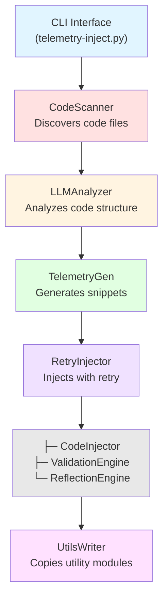

# Telemetry Injection System - Steering Document

## Table of Contents
1. [Project Overview](#project-overview)
2. [System Architecture](#system-architecture)
3. [Setup from Scratch](#setup-from-scratch)
4. [How It Works](#how-it-works)
5. [Usage Guide](#usage-guide)
6. [Testing](#testing)
7. [Extension Points](#extension-points)
8. [Troubleshooting](#troubleshooting)

## Project Overview

### Purpose
An LLM-powered system that automatically instruments source code with telemetry to capture function calls, variable changes, and loop iterations without modifying original functionality.

### Key Features
- **Multi-language support**: Python, JavaScript, TypeScript, Go, Java, C++, Rust
- **LLM-powered**: Uses GPT-4, Claude, or local Ollama models for intelligent instrumentation
- **DRY principle**: Shared utility modules eliminate code duplication
- **Validation**: Syntax, compilation, and runtime checks ensure code quality
- **Retry & reflection**: Self-healing injection with LLM-powered error analysis
- **Cost tracking**: Monitor API usage and costs
- **Nested directory support**: Works with complex project structures

### Use Cases
- Debugging complex applications
- Performance profiling
- Understanding code execution flow
- Educational purposes
- Compliance and audit trails

## System Architecture

### High-Level Components



### Data Flow

1. **Scan**: CodeScanner finds all code files in directory tree
2. **Analyze**: LLMAnalyzer identifies functions, loops, variables
3. **Generate**: TelemetryGenerator creates instrumentation snippets
4. **Inject**: RetryInjector applies snippets with validation
5. **Validate**: ValidationEngine checks syntax, compilation, runtime
6. **Reflect**: ReflectionEngine analyzes failures and suggests fixes
7. **Write**: Instrumented code written to output directory
8. **Utilities**: TelemetryUtilsWriter copies shared modules to all directories

## Setup from Scratch

### Prerequisites

```bash
# Required
- Python 3.8 or higher
- Git

# Optional (for specific features)
- Node.js (for JavaScript validation)
- OpenAI API key or Anthropic API key
- Ollama (for local LLM)
```

### Step 1: Clone Repository

```bash
git clone <repository-url>
cd claude-code-testing
```

### Step 2: Create Virtual Environment

```bash
python3 -m venv venv
source venv/bin/activate  # On Windows: venv\Scripts\activate
```

### Step 3: Install Dependencies

```bash
pip install -r requirements.txt
```

### Step 4: Configure API Keys

Option A: Use configuration wizard
```bash
python telemetry-inject.py --configure
```

Option B: Manual configuration
```bash
# Create .env file
cat > .env << 'EOF'
OPENAI_API_KEY=your-key-here
# OR
ANTHROPIC_API_KEY=your-key-here
# OR use local Ollama (no key needed)
EOF
```

### Step 5: Verify Installation

```bash
# Run tests
python -m pytest tests/ -v

# Expected output: 265+ tests passing with >78% coverage
```

### Step 6: Run Example

```bash
python telemetry-inject.py examples/sample_project -o output/

# Check output
ls -la output/
cat output/calculator.py  # View instrumented code
```

## How It Works

### Core Workflow

#### 1. Code Scanning
```python
# CodeScanner walks directory tree
# Detects language by extension
# Filters out ignored directories (.git, node_modules, etc.)
# Returns: List of {path, content, language}
```

#### 2. LLM Analysis
```python
# LLMAnalyzer sends code to LLM with structured prompt
# LLM identifies:
#   - Functions (name, parameters, line numbers)
#   - Loops (type, line numbers)
#   - Variables (name, scope, line numbers)
# Returns: AnalysisResult with structured data
```

#### 3. Telemetry Generation
```python
# TelemetryGenerator creates instrumentation snippets
# Each snippet contains:
#   - Type (func_entry, func_exit, loop_entry, var_change)
#   - Code to inject
#   - Target location (line number, indentation)
# Uses DRY utilities: from _telemetry_utils import tel
```

#### 4. Code Injection
```python
# RetryInjector attempts injection with retries
# CodeInjector uses LLM to:
#   - Place snippets at correct locations
#   - Match indentation precisely
#   - Preserve original functionality
# Returns: Instrumented code
```

#### 5. Validation
```python
# ValidationEngine performs multi-stage validation:
# 1. Complexity check (detect unsafe patterns)
# 2. Syntax check (ast.parse for Python)
# 3. Compilation check (compile to bytecode)
# 4. Runtime check (execute with timeout) [skipped for instrumented code]
```

#### 6. Reflection & Retry
```python
# On validation failure:
# ReflectionEngine analyzes errors
# Suggests fixes to LLM
# Retries injection with improved guidance
# Max retries: configurable (default 3)
```

#### 7. Utility File Management
```python
# TelemetryUtilsWriter:
# - Detects languages in processed files
# - Copies utility templates to EVERY directory
# - Creates .gitignore entries
# Ensures: All files can import _telemetry_utils
```

### DRY Implementation

**Before** (inline telemetry):
```python
import json, time, sys, uuid

def calculate(a, b):
    _start = time.perf_counter_ns()
    _corr_id = f"func_{uuid.uuid4().hex[:8]}"
    if os.getenv("DEBUG") == "true":
        print(json.dumps({...}), file=sys.stderr)
    # ... 10+ lines of boilerplate per function
    result = a + b
    # ... 5+ lines for exit
    return result
```

**After** (DRY with utilities):
```python
from _telemetry_utils import tel

def calculate(a, b):
    _tel_func = tel.func_entry("calculate", "a, b")
    result = a + b
    tel.func_exit(_tel_func, result)
    return result
```

Benefits:
- 90% less code per instrumentation point
- Centralized telemetry logic
- Easy to update telemetry format
- Faster LLM processing

## Usage Guide

### Basic Usage

```bash
# Instrument a single file
python telemetry-inject.py path/to/file.py -o output/

# Instrument entire directory
python telemetry-inject.py path/to/project -o output/

# Specify language filter
python telemetry-inject.py project/ -o output/ --extensions .py .js

# Increase retries for complex code
python telemetry-inject.py project/ -o output/ --max-retries 5
```

### Configuration Options

```bash
# Use specific LLM provider
python telemetry-inject.py project/ -o output/ --provider anthropic

# Use local Ollama
python telemetry-inject.py project/ -o output/ --provider ollama --model llama2

# Set API base URL (for proxy or custom endpoint)
python telemetry-inject.py project/ -o output/ --base-url http://localhost:8080

# Set cost budget
python telemetry-inject.py project/ -o output/ --budget 5.00

# Verbose output
python telemetry-inject.py project/ -o output/ --verbose

# Dry run (no file writes)
python telemetry-inject.py project/ -o output/ --dry-run
```

### Advanced Usage

#### Custom Configuration Menu
```bash
python telemetry-inject.py --configure
# Interactive menu for:
# - Provider selection
# - API key setup
# - Model selection
# - Base URL configuration
```

#### Selective Instrumentation
```python
# Modify LLM_GUIDANCE.md to customize what gets instrumented
# Control:
# - Which functions to instrument
# - Loop instrumentation preferences
# - Variable tracking scope
```

#### Testing Instrumented Code
```bash
# Run instrumented code with debug output
DEBUG=true python output/calculator.py

# Redirect telemetry to file
DEBUG=true python output/calculator.py 2> telemetry.log

# Run without telemetry
DEBUG=false python output/calculator.py
```

## Testing

### Running Tests

```bash
# All tests
python -m pytest tests/ -v

# Specific test file
python -m pytest tests/test_code_injector.py -v

# With coverage
python -m pytest tests/ --cov=src --cov-report=html

# Specific test
python -m pytest tests/test_validation_engine.py::TestPythonValidator::test_valid_python_code -v
```

### Test Structure

```
tests/
├── test_scanner.py              # File discovery
├── test_llm_analyzer.py         # LLM analysis
├── test_telemetry_generator.py  # Snippet generation
├── test_code_injector.py        # Code injection
├── test_validation_engine.py    # Validation logic
├── test_retry_reflection.py     # Retry & reflection
├── test_telemetry_utils_writer.py # Utility management
└── test_integration.py          # End-to-end tests
```

### Writing New Tests

```python
# Follow TDD approach
def test_new_feature():
    # 1. Arrange - setup test data
    engine = ValidationEngine()
    code = "def hello(): print('hi')"

    # 2. Act - execute functionality
    result = engine.validate(code, "python")

    # 3. Assert - verify expectations
    assert result.success
    assert result.syntax_valid
```

## Extension Points

### Adding New Language Support

1. **Update CodeScanner** (src/scanner.py):
```python
CODE_EXTENSIONS = {
    # ... existing ...
    ".rb": "ruby",  # Add new extension
}
```

2. **Add Validation** (src/validation_engine.py):
```python
class RubyValidator(BaseValidator):
    def validate_syntax(self, code: str) -> Tuple[bool, str]:
        # Implement Ruby syntax validation
        pass
```

3. **Create Utility Template** (src/telemetry_utils_template_ruby.rb):
```ruby
# Ruby telemetry utilities
class TelemetryCollector
  # ...
end
```

### Custom Telemetry Format

Modify templates in `src/telemetry_utils_template_*.{py,js}`:
```python
# Change telemetry output format
def _emit_json(self, data: Dict[str, Any]) -> None:
    # Custom format here
    print(json.dumps(data), file=sys.stderr)
```

### Custom LLM Providers

Add new provider in `src/llm_analyzer.py` or `src/telemetry_generator.py`:
```python
if provider == "custom":
    self.client = CustomLLMClient(api_key=api_key)
```

### Custom Validation Rules

Extend `ValidationEngine` with custom validators:
```python
class CustomValidator(BaseValidator):
    def validate(self, code: str) -> ValidationResult:
        # Custom validation logic
        pass
```

## Troubleshooting

### Common Issues

#### 1. ModuleNotFoundError: No module named '_telemetry_utils'

**Cause**: Utility files not in same directory as instrumented code

**Solution**: Already fixed! Utilities are now copied to all directories automatically.

**Manual Fix** (if needed):
```bash
cp src/telemetry_utils_template_python.py output/_telemetry_utils.py
```

#### 2. Runtime Timeout Errors

**Cause**: Validation attempting to run slow code

**Solution**: Already fixed! Runtime validation is skipped for instrumented code.

**Manual Override**:
```bash
# Disable runtime validation
python telemetry-inject.py project/ -o output/ --no-validate
```

#### 3. LLM API Errors

**Symptoms**: "API key invalid" or "Rate limit exceeded"

**Solutions**:
```bash
# Verify API key
python telemetry-inject.py --configure

# Use different provider
python telemetry-inject.py project/ -o output/ --provider anthropic

# Use local Ollama (no API key needed)
ollama serve
python telemetry-inject.py project/ -o output/ --provider ollama
```

#### 4. Test Failures

**Diagnosis**:
```bash
# Run tests with verbose output
python -m pytest tests/ -v --tb=short

# Run specific failing test
python -m pytest tests/test_name.py::test_function -vv
```

**Common Causes**:
- Missing dependencies: `pip install -r requirements.txt`
- Environment variables not set: Check .env file
- File permissions: Ensure write access to output directory

#### 5. Git Issues

**Symptoms**: "Modified files" or "Untracked files" that shouldn't be there

**Solution**:
```bash
# Remove from git tracking
git rm --cached output/ -r
git rm --cached _telemetry_utils.*

# Already in .gitignore, won't be tracked going forward
```

### Debug Mode

Enable verbose logging:
```bash
# Verbose CLI output
python telemetry-inject.py project/ -o output/ --verbose

# Telemetry debug output
DEBUG=true python output/instrumented_file.py
```

### Performance Optimization

For large projects:
```bash
# Reduce retries
python telemetry-inject.py project/ -o output/ --max-retries 1

# Use faster model
python telemetry-inject.py project/ -o output/ --model gpt-3.5-turbo

# Filter file types
python telemetry-inject.py project/ -o output/ --extensions .py

# Skip validation
python telemetry-inject.py project/ -o output/ --no-validate
```

## Next Steps

### For New Users
1. Complete [Setup from Scratch](#setup-from-scratch)
2. Run example in `examples/sample_project`
3. Read [QUICKSTART.md](../QUICKSTART.md) for quick reference
4. Review [docs/runbooks/](./runbooks/) for operational guides

### For Developers
1. Review [docs/architecture/](./architecture/) for system design
2. Read [docs/changelog/](./changelog/) for recent changes
3. Check [docs/diagrams/](./diagrams/) for visual architecture
4. Contribute: Fork, implement, test, submit PR

### For AI Assistants
To recreate this project from scratch:
1. Read this steering document entirely
2. Review architecture diagrams in [docs/diagrams/](./diagrams/)
3. Follow [Setup from Scratch](#setup-from-scratch) exactly
4. Reference [How It Works](#how-it-works) for implementation details
5. Use [Extension Points](#extension-points) for customizations

## Support

- **Issues**: Open GitHub issue with reproduction steps
- **Questions**: Check [docs/runbooks/](./runbooks/) first
- **Contributions**: See CONTRIBUTING.md (if exists)
- **Documentation**: All docs in [docs/](./docs/) directory

---

**Version**: 1.0.0
**Last Updated**: 2025-10-26
**Maintained By**: Development Team
