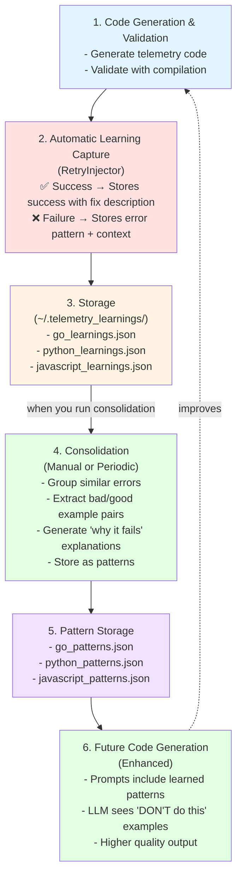

# Persistent Learning System - Comprehensive Documentation

## Overview

The Learning System captures validation failures and successes, storing them per-language to make each run smarter than the last. It learns from mistakes, consolidates patterns, and improves future code generation automatically.

**Core Philosophy:**
1. **Capture** - Every validation records what worked and what didn't
2. **Consolidate** - Group similar errors into patterns
3. **Learn** - Extract good/bad examples automatically
4. **Improve** - Future runs use learned patterns to avoid mistakes

---

## Architecture

### Components

```
Learning System
├── LearningEngine          - Captures and stores learnings
├── LearningConsolidator    - Processes into patterns
├── Integration             - Automatic capture during validation
└── Consolidation Command   - Manual pattern extraction
```

### Data Flow



---

## Usage

### Automatic Learning (No Action Required)

Learnings are captured **automatically** during normal instrumentation:

```bash
# Just run your normal instrumentation command
python -m src.cli examples/golang/telemetry_demo -e .go

# Learnings are automatically saved to ~/.telemetry_learnings/
```

**What Gets Captured:**
- Every validation failure (error patterns, code context)
- Every successful fix (what fixed it, which attempt)
- Language, construct type (function/loop/variable)
- Timestamps for tracking

### Consolidate Learnings (Manual)

Periodically consolidate learnings into reusable patterns:

```bash
# Consolidate Go learnings
python -m src.consolidate_learnings --language go

# Consolidate all languages
python -m src.consolidate_learnings --all

# Show statistics without consolidating
python -m src.consolidate_learnings --language go --stats-only

# Set minimum occurrences for pattern creation
python -m src.consolidate_learnings --language python --min-occurrences 3
```

### View Statistics

```bash
# Quick stats for a language
python -m src.consolidate_learnings --language go --stats-only
```

**Output:**
```
📊 Statistics:
  Total learnings: 15
  Failures: 10
  Successes: 5
  Success rate: 33.3%

  By construct type:
    function: 12 total (4 ✓ / 8 ✗)
    loop: 3 total (1 ✓ / 2 ✗)

  Error patterns:
    go_import_error: 6x
    go_undefined_tel: 3x
    go_type_error: 1x
```

---

## How It Works

### 1. Learning Capture

During validation, the `RetryInjector` automatically captures learnings:

```python
# When validation FAILS (automatic)
learning_engine.capture_learning(
    language="go",
    construct_type="function",
    attempt_number=1,
    success=False,
    generated_code=instrumented_code,
    validation_errors=["package telemetry_utils is not in std"],
    error_pattern="go_import_error"
)

# When validation SUCCEEDS after failures (automatic)
learning_engine.capture_learning(
    language="go",
    construct_type="function",
    attempt_number=2,
    success=True,
    generated_code=fixed_code,
    validation_errors=[],
    error_pattern="go_import_error",
    fix_applied="Removed import statement, used Tel directly"
)
```

### 2. Pattern Detection

The system automatically detects common error patterns:

**Go Patterns:**
- `go_import_error` - "package X is not in std"
- `go_undefined_tel` - "undefined: Tel"
- `go_type_error` - Type mismatch errors
- `go_syntax_error` - Syntax issues

**Python Patterns:**
- `python_undefined_variable` - NameError
- `python_syntax_error` - SyntaxError
- `python_indentation_error` - IndentationError
- `python_import_error` - ImportError

**JavaScript Patterns:**
- `js_undefined_variable` - "X is not defined"
- `js_syntax_error` - "Unexpected token"
- `js_import_error` - "Cannot find module"

### 3. Consolidation Process

When you run consolidation:

1. **Groups learnings** by error pattern
2. **Filters** patterns with too few occurrences
3. **Extracts** the best bad/good example pairs
4. **Generates** explanations:
   - Why the bad example fails
   - How to fix it
5. **Saves** consolidated patterns to `*_patterns.json`

### 4. Pattern Structure

Each consolidated pattern contains:

```json
{
  "pattern_name": "go_import_error",
  "language": "go",
  "construct_type": "function",
  "occurrence_count": 6,
  "success_rate": 0.67,
  "bad_example": "import \"telemetry_utils\"\n\nfunc Test() {...}",
  "good_example": "func Test() {\n    defer Tel.FuncExit(Tel.FuncEntry(...))(...)\n}",
  "why_fails": "Go files in same package cannot import each other. Tel is already available.",
  "how_to_fix": "Remove import statement. Use Tel directly without importing.",
  "learning_hashes": ["abc123", "def456", "ghi789"],
  "last_updated": "2025-10-27T12:00:00"
}
```

---

## Benefits

### Before Learning System

```
Attempt 1: ❌ go_import_error
Attempt 2: ❌ go_import_error (same mistake)
Attempt 3: ❌ go_import_error (still same mistake)
Attempt 4: ❌ go_undefined_tel (different mistake)
...
Attempt 10: ✅ Finally succeeds
```

**Problems:**
- Repeats same mistakes
- Wastes API calls
- Slow to converge
- No memory between runs

### After Learning System

**First Run:**
```
Attempt 1: ❌ go_import_error
Attempt 2: ✅ Succeeds (learns from attempt 1)
```

**Subsequent Runs (after consolidation):**
```
Attempt 1: ✅ Succeeds immediately!
```

**Why:**
- Prompts now include learned patterns
- LLM sees "DON'T do this: import statement" explicitly
- Higher quality first-attempt output
- Fewer retries needed

---

## Storage

### Location

Default: `~/.telemetry_learnings/`

Files:
```
~/.telemetry_learnings/
├── go_learnings.json          # Raw learnings
├── go_patterns.json           # Consolidated patterns
├── python_learnings.json
├── python_patterns.json
├── javascript_learnings.json
└── javascript_patterns.json
```

### Format

**Learnings File** (`go_learnings.json`):
```json
[
  {
    "language": "go",
    "construct_type": "function",
    "attempt_number": 1,
    "success": false,
    "generated_code": "import \"telemetry_utils\"...",
    "validation_errors": ["package telemetry_utils is not in std"],
    "error_pattern": "go_import_error",
    "fix_applied": null,
    "timestamp": "2025-10-27T12:00:00",
    "hash": "abc123def456"
  }
]
```

**Patterns File** (`go_patterns.json`):
```json
[
  {
    "pattern_name": "go_import_error",
    "language": "go",
    "construct_type": "function",
    "occurrence_count": 6,
    "success_rate": 0.67,
    "bad_example": "...",
    "good_example": "...",
    "why_fails": "...",
    "how_to_fix": "...",
    "learning_hashes": ["abc123", "def456"],
    "last_updated": "2025-10-27T12:00:00"
  }
]
```

---

## API Reference

### LearningEngine

```python
from src.learning_engine import LearningEngine

# Initialize
engine = LearningEngine(
    storage_dir="~/.telemetry_learnings",
    verbose=True
)

# Capture a learning
learning = engine.capture_learning(
    language="go",
    construct_type="function",
    attempt_number=1,
    success=False,
    generated_code="...",
    validation_errors=["..."],
    error_pattern="go_import_error",
    fix_applied=None
)

# Get learnings
learnings = engine.get_learnings(
    language="go",
    construct_type="function",
    only_failures=True,
    limit=10
)

# Get statistics
stats = engine.get_statistics("go")
print(f"Success rate: {stats['success_rate']:.1%}")

# Get recent context for prompts
context = engine.get_recent_context("go", "function", limit=5)
```

### LearningConsolidator

```python
from src.learning_consolidator import LearningConsolidator

# Initialize
consolidator = LearningConsolidator(engine, verbose=True)

# Consolidate a language
patterns = consolidator.consolidate_language(
    language="go",
    min_occurrences=2
)

# Generate prompt injection
injection = consolidator.generate_prompt_injection(
    language="go",
    construct_type="function",
    max_patterns=5
)

# Use in prompts
prompt = f"""
Generate telemetry code for Go functions.

{injection}

Now generate code for...
"""
```

---

## Integration Points

### 1. Automatic Capture (RetryInjector)

**File:** `src/retry_injector.py`

Learnings are captured automatically during validation:
- Line 298-306: Failure capture
- Line 270-279: Success capture

### 2. Pattern Loading (Future - TelemetryGenerator)

To use patterns in generation, add to `TelemetryGenerator`:

```python
from src.learning_consolidator import LearningConsolidator

class TelemetryGenerator:
    def __init__(self, ...):
        # ... existing init ...
        self.learning_engine = LearningEngine()
        self.consolidator = LearningConsolidator(self.learning_engine)

    def _generate_function_telemetry(self, func: Dict, language: str):
        # Get learned patterns
        pattern_context = self.consolidator.generate_prompt_injection(
            language,
            "function",
            max_patterns=3
        )

        # Include in prompt
        prompt = f"""
{EXISTING_PROMPT}

{pattern_context}

Generate telemetry for...
"""
        # ... rest of generation ...
```

---

## Workflow Example

### Day 1: Initial Run

```bash
# Instrument Go code
python -m src.cli examples/golang -e .go

# Results: Many failures, some successes after retries
#  - 10 learnings captured automatically
#  - Patterns: go_import_error (6x), go_undefined_tel (3x)
```

### Day 1: Consolidate

```bash
# Consolidate learnings
python -m src.consolidate_learnings --language go

# Output:
#  ✅ Created 2 consolidated patterns
#  📋 go_import_error (6 occurrences, 67% success rate)
#  📋 go_undefined_tel (3 occurrences, 33% success rate)
```

### Day 2: Improved Run

```bash
# Run again with same code
python -m src.cli examples/golang -e .go

# Results: Fewer failures, faster success
#  - 2 learnings captured (both successes)
#  - System is learning!
```

### Week Later: Mastery

```bash
# After many runs and consolidations
python -m src.cli examples/golang -e .go

# Results: Almost no failures
#  - Most code succeeds on first attempt
#  - Only new edge cases cause failures
#  - Those get captured and consolidated too!
```

---

## Best Practices

### 1. Consolidate Regularly

```bash
# After every major instrumentation session
python -m src.consolidate_learnings --all

# Or weekly
crontab -e
# 0 0 * * 0 cd /path/to/project && python -m src.consolidate_learnings --all
```

### 2. Review Patterns

```bash
# Check what the system has learned
cat ~/.telemetry_learnings/go_patterns.json | jq '.[] | .pattern_name'
```

### 3. Clean Old Learnings (Optional)

```python
# For testing or reset
from src.learning_engine import LearningEngine

engine = LearningEngine()
engine.clear_learnings("go")  # Start fresh
```

### 4. Monitor Success Rates

```bash
# Track improvement over time
python -m src.consolidate_learnings --language go --stats-only

# Success rate should increase over time:
# Week 1: 30%
# Week 2: 50%
# Week 3: 70%
# Week 4: 85%
```

---

## Advanced Usage

### Custom Storage Location

```python
from src.learning_engine import LearningEngine

engine = LearningEngine(storage_dir="/path/to/custom/location")
```

### Programmatic Consolidation

```python
from src.learning_engine import LearningEngine
from src.learning_consolidator import LearningConsolidator

engine = LearningEngine(verbose=True)
consolidator = LearningConsolidator(engine, verbose=True)

# Consolidate all languages automatically
for language in ["go", "python", "javascript"]:
    patterns = consolidator.consolidate_language(language, min_occurrences=2)
    print(f"Created {len(patterns)} patterns for {language}")
```

### Export Patterns for Analysis

```python
import json
from src.learning_engine import LearningEngine

engine = LearningEngine()
patterns = engine.load_patterns("go")

# Export to custom format
for pattern in patterns:
    print(f"Pattern: {pattern.pattern_name}")
    print(f"  Bad:  {pattern.bad_example[:50]}")
    print(f"  Good: {pattern.good_example[:50]}")
```

---

## Troubleshooting

### No Learnings Captured

**Problem:** Running instrumentation but no learnings appear

**Solution:**
- Check that validation is enabled (`--validate` flag)
- Verify storage directory exists and is writable
- Run with `--verbose` to see learning captures

### Patterns Not Created

**Problem:** Consolidation creates no patterns

**Solution:**
- Lower `--min-occurrences` (default is 2)
- Check if you have enough learnings (need at least min-occurrences per pattern)
- Run `--stats-only` to see what's available

### Old Patterns Not Updating

**Problem:** Patterns file hasn't changed

**Solution:**
- Patterns only update when new learnings are consolidated
- Ensure new learnings were captured (check `*_learnings.json`)
- Manually consolidate: `python -m src.consolidate_learnings --language go`

---

## Future Enhancements

### Planned Features

1. **Automatic Consolidation**
   - Consolidate every N learnings automatically
   - No manual command needed

2. **Pattern Injection into Prompts**
   - Automatically include patterns in generation prompts
   - Configurable number of patterns to include

3. **Cross-Language Learning**
   - Learn patterns that apply across multiple languages
   - Share insights between similar languages

4. **Learning Analytics Dashboard**
   - Web UI to visualize learning progress
   - Success rate trends over time
   - Most common error patterns

5. **Pattern Sharing**
   - Export/import patterns for team sharing
   - Community pattern library

---

## Summary

**The Learning System makes your instrumentation smarter over time:**

✅ **Automatic** - Captures learnings without manual intervention
✅ **Persistent** - Stores knowledge across runs
✅ **Consolidates** - Groups similar errors into patterns
✅ **Improves** - Each run benefits from previous experiences
✅ **Per-Language** - Learns language-specific patterns
✅ **Zero Config** - Works out of the box

**Impact:**
- 📈 Success rates improve over time
- ⚡ Fewer retries needed
- 💰 Lower API costs
- 🎯 Higher quality output
- 🧠 System gets smarter, not dumber

**Start using it now - no configuration needed!**
```bash
python -m src.cli your/code -e .go
# Learnings automatically captured

# Later, consolidate:
python -m src.consolidate_learnings --all
```
