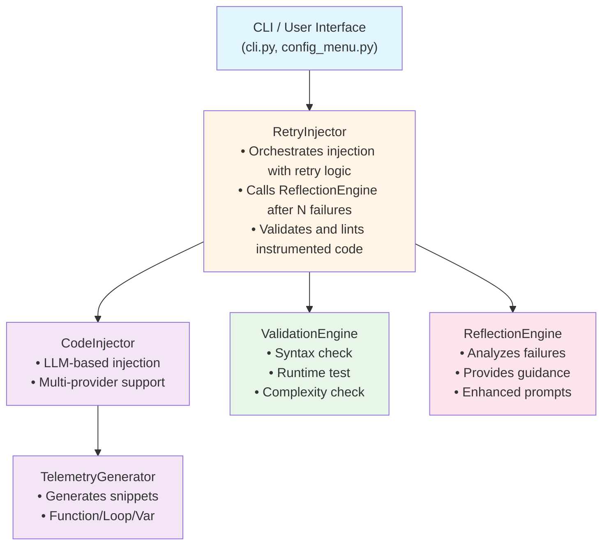
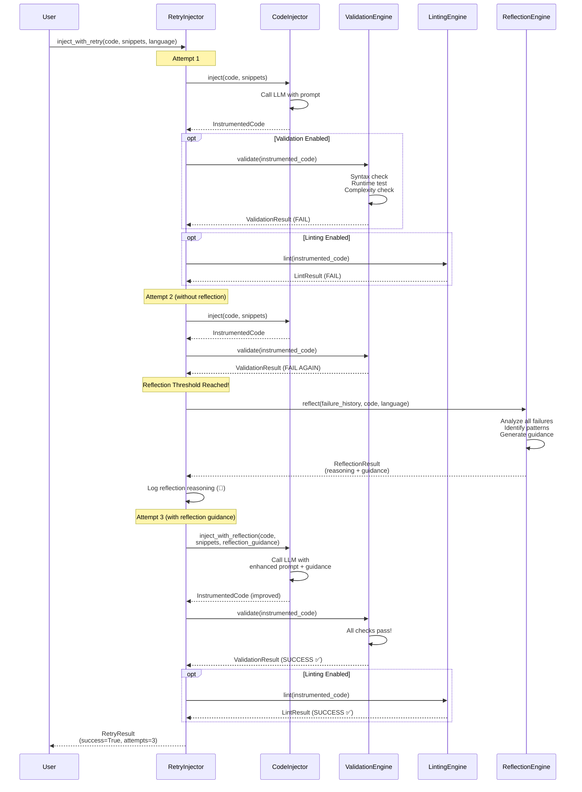

# LLM Developer Guidance for Claude Code Testing Project

**Last Updated**: 2025-10-25
**Project Purpose**: LLM-powered automatic telemetry injection with validation, reflection, and retry capabilities

---

## Table of Contents
1. [Critical Requirements](#critical-requirements)
2. [Architecture Overview](#architecture-overview)
3. [Lessons Learned](#lessons-learned)
4. [Common Pitfalls & Solutions](#common-pitfalls--solutions)
5. [Testing Requirements](#testing-requirements)
6. [Code Style & Patterns](#code-style--patterns)
7. [Current Status](#current-status)
8. [Quick Start for LLMs](#quick-start-for-llms)

---

## Critical Requirements

### 1. TDD (Test-Driven Development) - STRICTLY ENFORCED
- **Minimum Coverage**: 73% enforced (Goal: 90%)
- **Run tests after every change**: `venv/bin/pytest tests/ -v`
- **Coverage config**: See `.coveragerc` and `pytest.ini`
- **All tests must pass** before committing code
- CLI/interactive modules (`cli.py`, `config_menu.py`) excluded from coverage

### 2. Simplicity Constraints - CRITICAL
**Problem**: LLMs were generating overly complex telemetry code that caused syntax errors

**Example of BANNED CODE**:
```python
# ❌ NEVER DO THIS - Overly complex expression
_telemetry_data = {
    "function_name": globals().get('__name__', 'unknown') if '__name__' in dir()
        else (lambda: [f.__name__ for f in [obj for obj in map(lambda x: globals().get(x), dir())
        if callable(globals().get(x, None))] if hasattr(f, '__code__') and
        f.__code__.co_firstlineno <= 36 <= (f.__code__.co_firstlineno + len(f.__code__.co_code))]
        or ['unknown'])[0]()
}
```

**Always use SIMPLE code**:
```python
# ✅ CORRECT - Simple and readable
import inspect
_func_name = "unknown"
try:
    _func_name = inspect.currentframe().f_code.co_name
except:
    pass
```

**Simplicity Rules**:
1. ✅ Use simple variable assignments
2. ✅ Break complex operations into multiple lines
3. ✅ NO nested lambdas or complex comprehensions
4. ✅ Keep function name tracking simple (use `__name__` or hardcode it)
5. ✅ Avoid deep introspection (frame walking, `globals()` inspection)
6. ✅ Make code readable and maintainable
7. ✅ Keep expressions under 80 characters per line

### 3. Multi-Provider LLM Support - CRITICAL BUG FIXED
**Problem**: Code was breaking when using Anthropic provider

**Solution**: Always check `provider` before calling LLM APIs

```python
# ✅ CORRECT - Handle both providers
if self.provider == "anthropic":
    response = self.client.messages.create(
        model=self.model,
        max_tokens=8192,
        system=system_message,
        messages=[{"role": "user", "content": prompt}],
        temperature=0.1,
    )
    instrumented_code = response.content[0].text
else:
    # OpenAI-compatible API (OpenAI or Ollama)
    response = self.client.chat.completions.create(
        model=self.model,
        messages=[
            {"role": "system", "content": system_message},
            {"role": "user", "content": prompt}
        ],
        temperature=0.1,
    )
    instrumented_code = response.choices[0].message.content
```

**Key Files with Provider Logic**:
- `src/code_injector.py` (lines 461-499)
- `src/retry_injector.py` (lines 385-424)
- `src/telemetry_generator.py` (lines 292-329)
- `src/reflection_engine.py` (lines 232-270)

### 4. Cost Tracking - Always Include
Every LLM call should track costs if `cost_tracker` is available:

```python
if self.cost_tracker:
    if self.provider == "anthropic":
        self.cost_tracker.add_call(
            model=self.model,
            input_tokens=response.usage.input_tokens,
            output_tokens=response.usage.output_tokens
        )
    else:
        if hasattr(response, 'usage') and response.usage:
            self.cost_tracker.add_call(
                model=self.model,
                input_tokens=response.usage.prompt_tokens,
                output_tokens=response.usage.completion_tokens
            )
```

---

## Architecture Overview



### Sequence Diagram: Retry with Reflection



**Key Points**:
- Automatic retry up to MAX_RETRIES attempts
- Reflection triggered after REFLECTION_THRESHOLD failures
- LLM analyzes failure patterns and provides guidance
- Enhanced prompt includes reflection guidance
- Validation and linting at each attempt
- Complexity checks prevent overly complex code

### Key Components

1. **Scanner** (`src/scanner.py`): Finds code files in directory
2. **LLM Analyzer** (`src/llm_analyzer.py`): Analyzes code structure
3. **Telemetry Generator** (`src/telemetry_generator.py`): Generates telemetry snippets
4. **Code Injector** (`src/code_injector.py`): Injects telemetry into code
5. **Validation Engine** (`src/validation_engine.py`): Validates instrumented code
6. **Linting Engine** (`src/linting_engine.py`): Checks code quality
7. **Retry Injector** (`src/retry_injector.py`): Orchestrates retry with reflection
8. **Reflection Engine** (`src/reflection_engine.py`): LLM-powered failure analysis

---

## Lessons Learned

### 1. **Runtime Timeout Issues** (FIXED - 2025-10-25)
**Problem**: Validation failing with "Execution timeout after 5 seconds" even though syntax/compilation passed

**Root Cause**:
1. Telemetry code was causing blocking operations (sleep, input, network calls)
2. Loop iteration tracking creating infinite loops
3. Default timeout too short for instrumented code overhead
4. LLM not warned about avoiding blocking operations

**Solution**:
- **Increased timeout**: Changed from 5s to 15s in `src/validation_engine.py:474`
- **Added blocking operation warnings** to all prompts:
  - `src/code_injector.py`: New "AVOID BLOCKING OPERATIONS" section (lines 315-332)
  - `src/telemetry_generator.py`: Added to function/loop/variable prompts
  - `src/reflection_engine.py`: Added to critical reminders
- **Explicit banned operations**: sleep(), input(), network calls, heavy I/O
- **Performance requirement**: Telemetry must execute in <1ms per call

**Prevention**:
```python
# ❌ NEVER DO THIS in telemetry
time.sleep(1)  # Causes timeout!
input("Enter: ")  # Blocks!
requests.get("http://...")  # Network call!

# ✅ ALWAYS DO THIS
if os.getenv("DEBUG") == "true":  # Short-circuit FIRST
    print(json.dumps(data), file=sys.stderr)  # Fast, non-blocking
```

### 2. **Linting False Positives** (FIXED)
**Problem**: Linting reported "0 error(s), 0 warning(s)" but still failed validation

**Root Cause**: Success was determined by exit code, not error count

**Fix** (src/linting_engine.py):
```python
# ❌ WRONG - Based on exit code
return LintResult(success=False, ...)

# ✅ CORRECT - Based on error count
return LintResult(success=len(errors) == 0, ...)
```

### 3. **Overly Complex Telemetry Code** (FIXED)
**Problem**: LLM generated massive nested lambda/comprehension expressions causing syntax errors

**Solution**: Added simplicity constraints to ALL prompts:
- `src/code_injector.py`: "CRITICAL: KEEP TELEMETRY CODE SIMPLE!" section (lines 239-291)
- `src/telemetry_generator.py`: Simplicity constraints in all 3 prompts
- `src/validation_engine.py`: Added complexity checker that detects:
  - Nested lambdas
  - `globals()` manipulation
  - Deep frame inspection
  - Lines >150 characters

**Validation now FAILS** if complexity check fails, triggering retry with reflection.

### 3. **Anthropic Provider Breaking Reflection** (FIXED)
**Problem**: `'Anthropic' object has no attribute 'chat'` error on retry with reflection

**Root Cause**: `_inject_with_reflection()` only used OpenAI API format

**Fix** (src/retry_injector.py:385-424): Added provider detection

### 4. **LLM Thinking Process Visibility** (IMPLEMENTED)
**Requirement**: Show LLM's step-by-step reasoning when reflection occurs

**Implementation**:
- Added `reasoning` field to `ReflectionResult`
- Modified reflection prompt to include 5 thinking questions
- Display reasoning with `logger.reflection_reasoning()`
- Shows with 🧠 icon in verbose output

### 5. **Injection Prompts Need Examples** (IMPLEMENTED)
**Requirement**: Prompts must show good vs bad code examples

**Implementation** (src/code_injector.py):
- 5 detailed examples showing good/bad injection patterns
- Common mistakes list (14 items)
- Step-by-step injection process

---

## Common Pitfalls & Solutions

### Pitfall 1: Not Running Tests Before Committing
**Solution**: Always run `venv/bin/pytest tests/ -v` and ensure all pass

### Pitfall 2: Using Wrong API for Provider
**Solution**: Check `self.provider` before calling LLM:
```python
if self.provider == "anthropic":
    # Use messages.create()
else:
    # Use chat.completions.create()
```

### Pitfall 3: Forgetting Cost Tracking
**Solution**: Always check `if self.cost_tracker:` and track usage

### Pitfall 4: Breaking Existing Tests
**Solution**: Run full test suite, not just new tests. Current: 167 tests, all must pass.

### Pitfall 5: Creating Complex Telemetry Code
**Solution**:
- Use simple variable assignments
- Break into multiple lines
- Avoid lambdas, comprehensions, globals()
- Validation will catch this now!

### Pitfall 6: Not Using Verbose Logger
**Solution**: Use `VerboseLogger` to show progress:
```python
logger.stage("INJECT")
logger.file_start(file_path, language)
logger.analysis_result(func_count, loop_count, var_count)
```

### Pitfall 7: Hardcoding Paths
**Solution**: Use Path objects and relative paths where possible

---

## Testing Requirements

### Current Coverage Status
- **Total Coverage**: 73.94%
- **Enforced Minimum**: 73%
- **Goal**: 90%

### Files Needing More Coverage
| File | Current | Target | Lines Needed |
|------|---------|--------|--------------|
| validation_engine.py | 61% | 90% | ~64 lines |
| linting_engine.py | 64% | 90% | ~29 lines |
| code_injector.py | 64% | 90% | ~23 lines |
| llm_analyzer.py | 72% | 90% | ~14 lines |
| telemetry_generator.py | 72% | 90% | ~17 lines |

### Test Structure
```
tests/
├── test_code_injector.py       # CodeInjector tests
├── test_cost_tracker.py         # Cost tracking tests
├── test_integration.py          # End-to-end tests
├── test_json_utils.py          # JSON parsing utilities
├── test_linting_engine.py      # Linting tests (NEW)
├── test_llm_analyzer.py        # LLM analyzer tests
├── test_retry_reflection.py    # Retry & reflection tests
├── test_scanner.py             # File scanner tests
├── test_telemetry_generator.py # Telemetry generation tests
├── test_validation_engine.py   # Validation & complexity tests
└── test_verbose_logger.py      # Logging tests
```

### Running Tests
```bash
# Run all tests with coverage
venv/bin/pytest tests/ -v

# Run specific test file
venv/bin/pytest tests/test_code_injector.py -v

# Run specific test
venv/bin/pytest tests/test_code_injector.py::TestCodeInjector::test_injector_initialization_with_api_key -v

# Run with short traceback
venv/bin/pytest tests/ -v --tb=short
```

---

## Code Style & Patterns

### 1. Dataclasses for Results
Use `@dataclass` for all result objects:
```python
from dataclasses import dataclass

@dataclass
class MyResult:
    success: bool
    message: str
    data: Dict
```

### 2. Type Hints - Always Include
```python
def process_code(code: str, language: str) -> InjectionResult:
    pass
```

### 3. Docstrings - Required
```python
def my_function(param: str) -> bool:
    """
    Brief description.

    Args:
        param: Description of parameter

    Returns:
        Description of return value
    """
    pass
```

### 4. Error Handling
```python
try:
    result = risky_operation()
except SpecificException as e:
    logger.log(f"Operation failed: {e}", LogLevel.ERROR)
    return failure_result()
```

### 5. File References in Comments
When referencing code locations: `src/file.py:123`

### 6. Markdown Code Fence Removal
Always remove markdown fences from LLM responses:
```python
if instrumented_code.startswith("```"):
    lines = instrumented_code.split("\n")
    lines = lines[1:]  # Remove first line (```language)
    if lines and lines[-1].strip() == "```":
        lines = lines[:-1]
    instrumented_code = "\n".join(lines)
```

---

## Current Status

### Recently Completed
✅ Fixed Anthropic API bug in reflection injection (src/retry_injector.py:385-424)
✅ Added TDD coverage enforcement (73% minimum, goal 90%)
✅ Created comprehensive linting engine tests (+11 tests)
✅ Added complexity checking to validation engine
✅ Implemented simplicity constraints across all prompts
✅ Added LLM thinking process visibility in reflection
✅ Enhanced injection prompts with good/bad examples

### Known Issues
⚠️ **API Overload Errors**: Anthropic API sometimes returns "Overloaded" (500 error)
- This is transient and should trigger retry
- Not a code issue, but user should be aware

⚠️ **Complexity Warnings Still Occur**:
- Validation now catches these and triggers reflection
- Should self-heal through retry mechanism

### Next Priorities
1. Increase test coverage to 80% (intermediate goal)
2. Add more validation engine tests
3. Improve linting engine coverage
4. Add integration tests for Anthropic provider

---

## Quick Start for LLMs

### 1. Understand the Current State
```bash
# Check test status
venv/bin/pytest tests/ -v

# Check coverage
venv/bin/pytest tests/ --cov=src --cov-report=term-missing

# See what's running
ls -la *.py
```

### 2. Read Key Files First
**MUST READ** (in order):
1. `LLM_GUIDANCE.md` (this file)
2. `README.md` (project overview)
3. `.coveragerc` (coverage requirements)
4. `src/retry_injector.py` (main orchestration)
5. `src/code_injector.py` (injection logic)

### 3. Check Recent Changes
```bash
# See recent commits
git log --oneline -10

# See current branch
git branch

# See what changed recently
git diff HEAD~5..HEAD
```

### 4. Before Making Changes
- [ ] Read relevant test file
- [ ] Understand the component's role
- [ ] Check if provider-specific logic needed
- [ ] Plan to add tests for new functionality
- [ ] Ensure change won't break existing tests

### 5. After Making Changes
- [ ] Run full test suite: `venv/bin/pytest tests/ -v`
- [ ] Verify coverage didn't drop: Check TOTAL percentage
- [ ] Test both OpenAI and Anthropic providers if applicable
- [ ] Update this guidance file if new lessons learned
- [ ] Update docstrings and type hints

### 6. Common Development Tasks

**Add a new test**:
```python
# Pattern to follow (see existing tests)
def test_my_feature(self):
    """Test description."""
    # Setup
    engine = MyEngine()

    # Execute
    result = engine.do_something()

    # Assert
    assert result.success
    assert result.value == expected
```

**Add a new feature**:
1. Write failing test first (TDD)
2. Implement feature
3. Ensure test passes
4. Run full test suite
5. Update coverage

**Fix a bug**:
1. Write test that reproduces bug
2. Verify test fails
3. Fix the bug
4. Verify test passes
5. Run full test suite

---

## Environment Setup

### Required Tools
- Python 3.12+
- Virtual environment: `venv/`
- pytest with coverage plugin

### Environment Variables
```bash
# For OpenAI
export OPENAI_API_KEY="sk-..."
export LLM_PROVIDER="openai"
export LLM_MODEL="gpt-4"

# For Anthropic
export ANTHROPIC_API_KEY="sk-ant-..."
export LLM_PROVIDER="anthropic"
export LLM_MODEL="claude-3-5-sonnet-20241022"

# For Ollama (local)
export LLM_PROVIDER="ollama"
export LLM_BASE_URL="http://localhost:11434/v1"
export LLM_MODEL="codellama"

# Enable telemetry output
export DEBUG="true"
```

### Installation
```bash
# Activate virtual environment
source venv/bin/activate

# Install dependencies
pip install -r requirements.txt

# Run tests
pytest tests/ -v
```

---

## Examples

### Example: Fibonacci with Network Posting
See `examples/README_FIBONACCI.md` for complete example of:
- HTTP POST to receiver server
- Base64 encoding responses
- Graceful failure handling
- Both Python and JavaScript implementations

### Example: Running the Tool
```bash
# Interactive configuration
venv/bin/python telemetry-inject.py --configure

# Process a directory
venv/bin/python telemetry-inject.py examples/sample_project/

# With verbose output
venv/bin/python telemetry-inject.py examples/sample_project/ -v
```

---

## Critical Files Reference

### Configuration Files
- `pytest.ini` - Test configuration, coverage enforcement
- `.coveragerc` - Detailed coverage rules, exclusions
- `requirements.txt` - Python dependencies

### Core Library (src/)
- `cli.py` - Command-line interface (excluded from coverage)
- `config_menu.py` - Interactive configuration (excluded from coverage)
- `code_injector.py` - Main injection logic (64% coverage)
- `cost_tracker.py` - API cost tracking (96% coverage)
- `json_utils.py` - JSON parsing utilities (95% coverage)
- `linting_engine.py` - Code quality checking (64% coverage)
- `llm_analyzer.py` - Code structure analysis (72% coverage)
- `reflection_engine.py` - Failure analysis (76% coverage)
- `retry_injector.py` - Orchestration with retry (81% coverage)
- `scanner.py` - File discovery (76% coverage)
- `telemetry_generator.py` - Snippet generation (72% coverage)
- `validation_engine.py` - Code validation (61% coverage)
- `verbose_logger.py` - Logging utilities (84% coverage)

### Test Files (tests/)
All files start with `test_*` and mirror the structure of `src/`

### Documentation
- `README.md` - Project overview
- `LLM_GUIDANCE.md` - This file
- `examples/README_FIBONACCI.md` - Fibonacci example documentation

---

## Troubleshooting

### Tests Failing
1. Check if all dependencies installed: `pip install -r requirements.txt`
2. Verify Python version: `python --version` (need 3.12+)
3. Check for API key issues (mock tests shouldn't need keys)
4. Look at specific failing test output

### Coverage Dropping
1. Check which files lost coverage: `pytest --cov=src --cov-report=term-missing`
2. Add tests for uncovered lines
3. Run coverage report: `pytest --cov=src --cov-report=html` (opens in browser)

### Provider-Specific Issues
1. Verify `LLM_PROVIDER` environment variable
2. Check if both providers handled in code
3. Look at `src/code_injector.py` for pattern
4. Ensure cost tracking works for provider

### Import Errors
1. Ensure virtual environment activated: `source venv/bin/activate`
2. Reinstall dependencies: `pip install -r requirements.txt`
3. Check PYTHONPATH if needed

---

## Final Checklist for LLMs

Before claiming work is complete:

- [ ] All 167+ tests pass
- [ ] Coverage >= 73.94%
- [ ] No regressions in coverage
- [ ] Both OpenAI and Anthropic providers work (if applicable)
- [ ] Cost tracking included (if LLM calls added)
- [ ] Simplicity constraints followed
- [ ] Docstrings and type hints added
- [ ] This guidance file updated if new lessons learned
- [ ] Examples still work if changed
- [ ] No breaking changes to existing API

---

## Contact & Resources

**Repository Structure**: Standard Python project with src/ and tests/
**Test Framework**: pytest with coverage plugin
**Code Style**: PEP 8 with type hints
**Documentation**: Docstrings + Markdown files

**When in doubt**:
1. Look at existing similar code
2. Check the tests for usage examples
3. Read the docstrings
4. Follow the patterns already established

---

**Remember**: This project is about LLMs instrumenting code with LLM-powered reflection. Meta is the point. Keep code simple, test thoroughly, and document lessons learned.
