# System Architecture Diagrams

## Table of Contents
1. [System Overview](#system-overview)
2. [Instrumentation Flow](#instrumentation-flow)
3. [Validation Pipeline](#validation-pipeline)
4. [Retry & Reflection](#retry--reflection)
5. [DRY Implementation](#dry-implementation)

---

## System Overview

### High-Level Component Diagram

---

## Instrumentation Flow

### Complete End-to-End Sequence

---

## Validation Pipeline

### Multi-Stage Validation Process

---

## Retry & Reflection

### Self-Healing Injection Process

```mermaid
sequenceDiagram
    participant CLI as CLI
    participant Injector as RetryInjector
    participant CodeInj as CodeInjector
    participant Validator as ValidationEngine
    participant Reflector as ReflectionEngine
    participant LLM as LLM API

    CLI->>Injector: inject_with_retry(code, snippets, language, max_retries=3)

    Note over Injector: Attempt 1
    Injector->>CodeInj: inject(code, snippets, language)
    CodeInj->>LLM: Inject telemetry<br/>(no guidance)
    LLM-->>CodeInj: Instrumented code v1
    CodeInj-->>Injector: InjectionResult v1

    Injector->>Validator: validate(instrumented_code)

    alt Validation succeeds
        Validator-->>Injector: ValidationResult(success=True)
        Injector-->>CLI: RetryInjectionResult(succeeded=True, attempts=1)
    else Validation fails
        Validator-->>Injector: ValidationResult(success=False, errors=["Syntax error line 42"])

        Note over Injector: Attempt 2 with Reflection
        Injector->>Reflector: reflect(failures, code, snippets)
        Reflector->>Reflector: Analyze failure patterns
        Reflector->>LLM: What went wrong?<br/>How to fix?<br/>Previous errors: ...
        LLM-->>Reflector: Guidance:<br/>"Indentation mismatch at line 42.<br/>Ensure telemetry matches function body."
        Reflector-->>Injector: ReflectionResult(guidance)

        Injector->>CodeInj: inject(code, snippets, language, guidance)
        CodeInj->>LLM: Inject telemetry<br/>(with guidance)
        LLM-->>CodeInj: Instrumented code v2
        CodeInj-->>Injector: InjectionResult v2

        Injector->>Validator: validate(instrumented_code)

        alt Validation succeeds
            Validator-->>Injector: ValidationResult(success=True)
            Injector-->>CLI: RetryInjectionResult(succeeded=True, attempts=2)
        else Still failing after max retries
            Validator-->>Injector: ValidationResult(success=False)
            Note over Injector: Max retries exhausted
            Injector-->>CLI: RetryInjectionResult(succeeded=False,<br/>attempts=3,<br/>failure_reasons=[...])
        end
    end
```

---

## DRY Implementation

**Important**: The utility files (`_telemetry_utils.py`, `_telemetry_utils.js`) are **automatically excluded** from being scanned and instrumented by the `CodeScanner`. This prevents recursive instrumentation and ensures these utility files can be safely modified without being processed.

The exclusion is configured in `src/scanner.py:IGNORED_FILES` and works for utility files in any directory (root or nested subdirectories).

### Utility File Management

### Import Resolution

---

## Component Interactions

### Cost Tracking Integration

---

## Notes

### Diagram Conventions

- **Solid lines**: Data flow or function calls
- **Dashed lines**: Return values or responses
- **Dotted lines**: Imports or references
- **Green boxes**: Generated files
- **Blue boxes**: External services
- **Yellow boxes**: User interactions

### Updating Diagrams

These diagrams use Mermaid syntax. To update:

1. Edit the Mermaid code directly
2. Preview using GitHub or Mermaid Live Editor
3. Ensure diagrams render correctly before committing

### Additional Diagrams

For more specific component interactions, see:
- `docs/architecture/COMPONENT_DETAILS.md` - Detailed component specifications
- `docs/architecture/DATA_FLOW.md` - Data transformation details
- `docs/runbooks/DEBUGGING.md` - Debugging workflows

---

**Last Updated**: 2025-10-26
